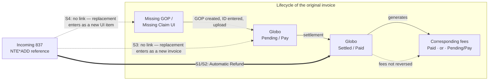
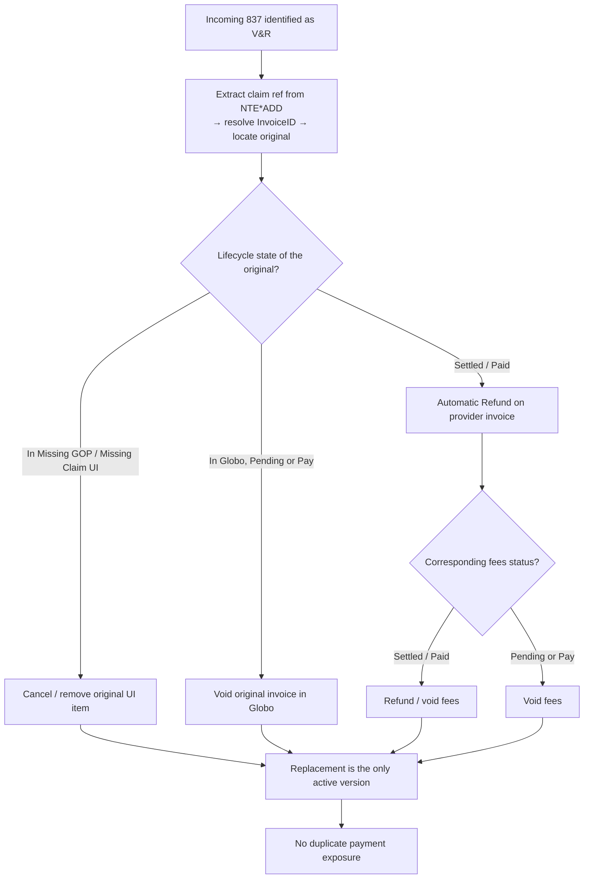

# Void & Reissue (V&R) — Current Behavior, Expected Behavior, and Gaps

Internal engineering reference. Describes the V&R automation as it behaves today, what it is
expected to do, and what Billing must do by hand to close the difference.

Everything below is derived from the behavior described by Billing/Operations. Items that could
not be confirmed from that description are explicitly marked **[requires technical confirmation]**
and must not be treated as known behavior.

---

## 1. Vocabulary

Terms are used strictly as defined here for the rest of the document.

| Term | Meaning in this document |
| --- | --- |
| **Provider invoice** | The financial document created from an incoming provider claim (837). The object that gets settled/paid. |
| **Corresponding fees** | Fee records generated from a provider invoice. They carry their own status (Pending / Pay / Settled-Paid) and their own payment eligibility. |
| **Original invoice** | The provider invoice referenced by the incoming V&R, identified via the `NTE*ADD` claim reference. The version being superseded. |
| **Replacement invoice** | The provider invoice carried by the incoming V&R 837. The version that should supersede the original. |
| **Globo** | The system the invoice is uploaded into and where it progresses through Pending → Pay → Settled/Paid, and where a void/refund is applied. |
| **Missing GOP / Missing Claim UI** | Pre-Globo intake queues in the user interface. An invoice sitting here has not yet been uploaded into Globo; a user must create a GOP and supply the required ID to move it forward. |
| **Automatic Refund** | The existing automated reversal the V&R automation performs on a **settled** provider invoice. It acts on the provider invoice only. |
| **Manual intervention** | Any action the Billing team must perform by hand because the automation does not perform it. |

---

## 2. Trigger and identification logic

**Trigger:** an incoming 837 that contains Void & Reissue information.

The automation identifies the original invoice from the `NTE*ADD` segment:

```
NTE*ADD*Rplcmnt fr Voided Clm 13630117~
```

1. Extract the referenced claim value — `13630117`.
2. Search for the InvoiceID against which that value was registered.
3. Use that InvoiceID to locate the original invoice.

The reference is therefore available on every V&R, independent of where the original invoice
currently sits in its lifecycle. What differs today is **what the automation does with it** once the
original has been located.

> **[requires technical confirmation]** In Scenarios 3 and 4 the original is not neutralized. It is
> not established from the described behavior whether the `NTE*ADD` lookup (a) is not executed,
> (b) executes but fails to resolve for a non-settled / not-yet-uploaded original, or (c) resolves
> successfully but has no downstream action wired to it. The fix differs per case.

---

## 3. Scenario comparison matrix (main view)

| # | Original invoice state | Corresponding fees state | Current — original invoice | Current — fees | Current — replacement invoice | Expected | Manual intervention today |
| --- | --- | --- | --- | --- | --- | --- | --- |
| **S1** | Settled / Paid (in Globo) | Settled / Paid | **Automatic Refund applied** — identified via `NTE*ADD`, refunded | **Not refunded** — left as paid (confirmed with Billing) | Can be processed after the refund | Refund provider invoice **and** automatically refund/void the corresponding fees — reversed together as one financial transaction | Billing manually refunds the fees of the original invoice |
| **S2** | Settled / Paid (in Globo) | Pending or Pay (created, not settled) | **Automatic Refund applied** | **Untouched** — remain in Pending/Pay and therefore **still eligible for payment** | Can be processed after the refund | Refund provider invoice **and** automatically void any fees still in Pending/Pay — they belong to a superseded invoice version | Billing manually identifies and voids the fees created for the original invoice |
| **S3** | Pending or Pay, already in Globo | n/a to the described flow | **Not voided** — remains active in Globo | — | **Treated as a new invoice.** Lands in Missing GOP / Missing Claim UI; user creates a new GOP, enters the required ID, uploads into Globo. Upload does **not** void the original → **both versions coexist in Globo** | Identify original via V&R reference → automatically void it → create/upload the replacement → replacement is the only version valid for further processing/payment | Billing manually voids the original invoice in Globo to prevent duplicate payment |
| **S4** | Not yet in Globo — sitting in Missing GOP and/or Missing Claim UI | n/a to the described flow | **No automated connection** between the original UI item and the replacement | — | Appears in the UI as **another new invoice**; both versions remain available for processing | Recognize from the V&R reference that the incoming invoice supersedes an item already in intake → **if still in the UI:** cancel/remove the original from processing; **if already uploaded into Globo:** void the original. Replacement becomes the active version. System prevents both versions progressing independently | If Billing recognizes the V&R: manually remove the original UI item, **or** — if the original has already reached Globo by then — manually void it in Globo |

**Severity read:** S1 leaves an unrecovered fee payment. S2, S3 and S4 leave a *payable* artifact
alive (unpaid fees, or a whole second invoice) — i.e. active duplicate-payment exposure that is
caught only by a human noticing.

---

## 4. Current vs. Expected, per scenario

### S1 — Provider invoice and corresponding fees already settled

**Initial state:** provider invoice Settled/Paid; corresponding fees Settled/Paid.

| Current behavior | Expected behavior |
| --- | --- |
| 1. Automation reads the `NTE*ADD` segment.<br>2. Automation identifies the original invoice.<br>3. Automation performs **Automatic Refund** on the provider invoice.<br>4. The replacement invoice can then be processed.<br>5. The corresponding fees are **not refunded**. *(confirmed with the Billing team)* | When the original provider invoice is refunded because of a V&R, the corresponding fees generated from that invoice should also be automatically refunded/voided. The original financial transaction and its associated fees should be reversed together. |

**Manual intervention today:** the Billing team manually refunds the fees associated with the
original invoice.

### S2 — Provider invoice settled, fees created but not yet settled

**Initial state:** provider invoice Settled/Paid; corresponding fees Pending or Pay.

| Current behavior | Expected behavior |
| --- | --- |
| 1. Automation identifies the original provider invoice.<br>2. Automation performs **Automatic Refund** on the provider invoice.<br>3. The corresponding fees remain untouched in Pending or Pay status.<br><br>→ Fees relating to an already-voided invoice remain eligible for payment. | When the original provider invoice is voided/refunded, any corresponding fees still in Pending or Pay status should also be automatically voided — they are no longer valid, because they belong to the superseded version of the provider invoice. |

**Manual intervention today:** the Billing team manually identifies and voids the fees created for
the original invoice.

### S3 — Original provider invoice still Pending or Pay in Globo

**Initial state:** provider invoice Pending or Pay; original invoice already exists in Globo; not
yet settled.

| Current behavior | Expected behavior |
| --- | --- |
| 1. The automation does **not** treat the incoming invoice as a replacement of the existing invoice.<br>2. The replacement appears in the UI under **Missing GOP** or **Missing Claim**, behaving as a new invoice.<br>3. The user must create a new GOP in the case.<br>4. The user enters the required ID in the UI.<br>5. The replacement invoice is uploaded into Globo.<br>6. Uploading the replacement does **not** void the original.<br><br>→ Original and replacement can exist in Globo simultaneously. | 1. Automation identifies the original invoice through the V&R reference.<br>2. Automation automatically voids the original invoice.<br>3. Automation creates/uploads the replacement version.<br>4. Only the replacement invoice remains valid for further processing/payment. |

**Manual intervention today:** the Billing team manually voids the original invoice to prevent
duplicate payment.

### S4 — Original invoice has not yet reached Globo

**Initial state:** original provider invoice not yet uploaded into Globo; still present in the
Missing GOP and/or Missing Claim UI.

| Current behavior | Expected behavior |
| --- | --- |
| 1. The replacement appears in the UI as another new invoice.<br>2. There is **no automated connection** between the original UI item and the replacement V&R item.<br>3. Both versions can remain available for processing.<br><br>If Billing recognizes the new invoice as a V&R:<br>• original still in Missing GOP / Missing Claim UI → team manually removes the original item;<br>• original already uploaded into Globo by then → team manually voids it in Globo. | The V&R reference should let the system identify that the incoming invoice supersedes an invoice already present in the intake process.<br><br>**If the original is still in the Missing GOP / Missing Claim UI:**<br>1. The original is automatically cancelled/removed from processing.<br>2. The replacement becomes the active version.<br><br>**If the original has already moved into Globo:**<br>1. The original is automatically voided.<br>2. The replacement becomes the active version.<br><br>The system should prevent both invoice versions from progressing independently. |

**Manual intervention today:** as described above — manual removal of the UI item, or manual void
in Globo, and only when a human recognizes the invoice as a V&R.

---

## 5. Lifecycle view

The required behavior depends primarily on **where the original invoice is in its lifecycle when
the V&R arrives.**



*Current behavior. Dashed = no automated link; the original (or its fees) survives the V&R.*



*Expected behavior: one dispatch on lifecycle state, then fee handling where applicable.*

---

## 6. Developer summary of the gaps

| ID | Gap | Scenarios | Consequence |
| --- | --- | --- | --- |
| **G1** | Fee reversal is not chained to invoice reversal. Automatic Refund acts on the provider invoice only. | S1, S2 | S1: fees stay paid and unrecovered. S2: fees stay payable against a voided invoice. |
| **G2** | No void path for a non-settled original. A V&R against an original in Globo Pending/Pay does not void it. | S3 | Two live invoices in Globo for the same claim → duplicate payment exposure. |
| **G3** | No linkage at intake. A V&R against an original still in Missing GOP / Missing Claim is not connected to that UI item. | S4 | Two independent items progress through intake; nothing prevents both reaching Globo. |
| **G4** | Reversal action is not selected by lifecycle state. The only wired outcome is Automatic Refund on a settled invoice; the other states have no outcome. | S3, S4 | The `NTE*ADD` reference is effectively unused outside the settled case. |

**Root cause, stated once:** the automation implements V&R as *"refund a settled provider
invoice"*, not as *"replace whatever version currently exists, wherever it currently sits."*
There is no dispatch on the original's lifecycle state, and no propagation from the invoice
reversal to its dependent fee records.

**Overarching requirement:**

> A V&R should behave as a **replacement transaction, not as an independent new invoice.** Once the
> replacement is identified through the `NTE*ADD` reference, the system should automatically
> neutralize the previous version wherever it currently sits in the workflow, including any
> associated fees where applicable.

---

## 7. Potential Functional Rule

Developer-oriented expression of the desired behavior. Pseudocode, not an implementation contract.

```
IF incoming 837 is identified as V&R
  → locate original invoice using NTE*ADD reference
      extract claim ref → resolve InvoiceID → locate original invoice
  → determine current lifecycle state of original
  → neutralize original invoice appropriately
      state = Missing GOP / Missing Claim UI  → cancel / remove item from processing
      state = Globo, Pending or Pay           → void original invoice
      state = Globo, Settled / Paid           → Automatic Refund on provider invoice
  → neutralize associated fees where applicable
      fees Settled / Paid    → refund / void fees
      fees Pending or Pay    → void fees
  → process replacement as the only active version
  → prevent duplicate payment exposure
      original and replacement must never both be eligible for payment
```

---

## 8. Open items requiring technical confirmation

These are **not** described behavior. They must be answered before requirements are finalized.

1. Whether the `NTE*ADD` lookup runs, resolves, or is simply not acted on for non-settled and
   not-yet-uploaded originals (see §2).
2. At which lifecycle point corresponding fees are generated from a provider invoice. S2 confirms
   fees can exist while unsettled, but the creation trigger is not described here.
3. Whether "refund" and "void" on fees are distinct operations in the fee model, or one operation
   whose effect depends on fee status.
4. Whether the Missing GOP and Missing Claim queues are one item or two separate items for the same
   invoice, and therefore whether cancellation must target both.
5. Behavior when the `NTE*ADD` reference resolves to no invoice, to more than one invoice, or to an
   invoice already voided by an earlier V&R (chained V&R).
6. Whether the replacement should be blocked from processing if neutralizing the original fails
   partway through — i.e. whether the sequence needs to be atomic.
